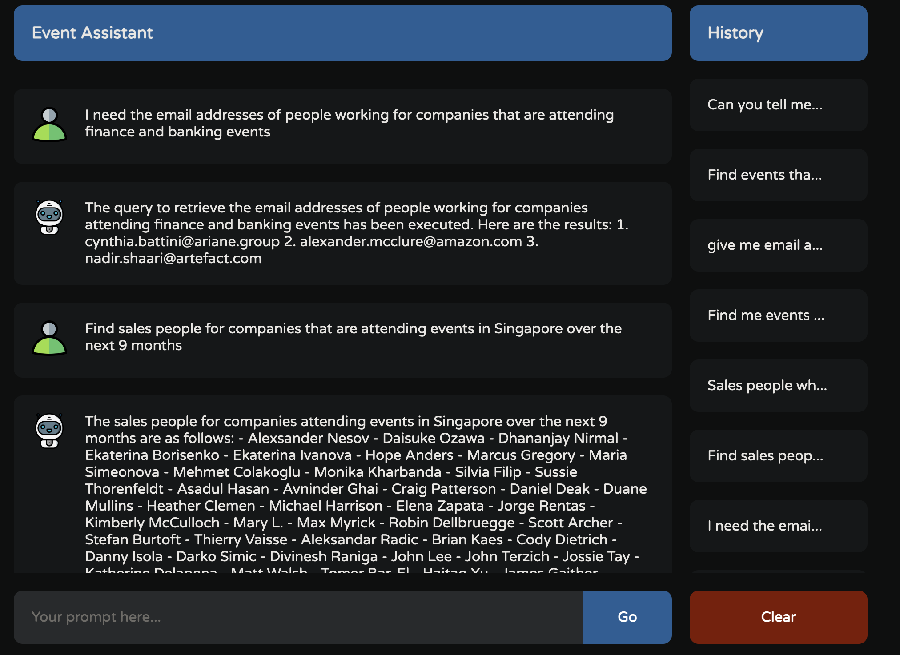

# byte-genie-server
# Requirements
1. openAI API key.
2. python version > 3.8
3. sqlite3 installed (brew install sqlite3)

#Setup 
1. Clone the repo ``` git clone https://github.com/AyRawat/byte-genie-server.git```
2. Go inside the repo ``` cd byte-genie-server ```
3. Create a virtual env ``` python3 -m venv:venv```
4. Activate the virtual env ``` source venv/bin/activate```
5. Add a .env file and add these two keys with values inside it ```OPENAI_API_KEY="<REPLACE THIS TEXT WITHYOUR OPENAI API KEY></REPLACE>" \n OPENAI_MODEL_NAME="gpt-3.5-turbo-1106"```
6. Install dependencies ``` pip -r install requirements.txt```
7. Setup the db ``` python -m prepare_sql_db``` 
8. Run ```flask --debug run ```

and the server will start at ```127.0.0.1:5000```


# Motivation
User can interact with the database in natural language.

## Data Processing

### Issues with the raw data
1. Missing data in fields like phone number , revenue and employees etc.
2. Heterogeneous format of the data in company_revenue and n_employees like  11-50, 420.0 or 10001 employees
3. Missing fields like email of the employee and industry of the event that it is related to.
4. Fields that are not in Normalized formats , comapny_industry . A company can have multiple industries.

### Data cleaning
1. For the field n_employee ,that denotes number of employee,  cannot have mull values. So I imputed the null records by 10 for employees, otherwise I took a mean of the range , where it was given and in case of float I kept it as it is. APart from this the format 501 employees, I also converted that to float.
2. For the field company_revenue, I chose to convert all values into million. and stored in in Float format.
3. Created an email field using email_pattern . In order to reduce the noise in db. Because either way the column email_pattern was of no use in itself. I had to process the email from it later. So, after processing the email_pattern can be removed 
4. For the people who had missing email_pattern , I assumed the default patttern [first].[last]@homepage_base_url

### Consistency Check
1. After performing the clean up on n_employees and revenue the format was consistent. 

### Improving Data understanding
1. Created an event_industry column in event table, that can identify the type of industry based on the event_name and event_overview.

### Improvement (Problem Faced)
Stemming and lemmatization : There is a field company_industry, which can hold multiple values. Normalizing it was creating two set of extra tables. And when I was feeding queries to my model, the query was getting very complex and was also getting expensive. Therefore, I decided to use LIKE operator for comparing an industry. Also the problem with the data was, duplication of industries. If I had gone with the lemmatization then construction and Residential Construction would have come under the same category that is construction.

## API

### Technologies used
1. Flask : Python library to create a server, That can handle incoming requests. 
2. slite3 : SQL DB for storing and retrieving the data.
3. langchain : A framework to build llms
4. model : In the begining I decided to use an Open source model [Mistral-Large-instruct-2407](https://huggingface.co/mistralai/Mistral-Large-Instruct-2407), but neither did my machine had gpu nor was it powerful enough to sustain the load. Then I decided to use openAi's [gpt-3.5-turbo](https://platform.openai.com/docs/models/gpt-3-5-turbo)
Reason for chosing this was that it can handle the textual transformation and it was inexpensive as compared to gpt-4  

### Flow
```
Request(Question) --> LLM(creates Query) --> SQL DB(query_executed) --> LLM(forms answer in Natural Language) --> Response (Answer)
```

### Agent improvements
1. Agent was equipped with a toolkit , that contains a tool for fetching the table description. It fetched the table description from a csv file that I have created, It helps the agent to select only the right table, instead of querying all the tables.
In the payload API takes two arguments, first one being the question and second one is the history object that contains the previous chats. 

### Request
```
curl --location '127.0.0.1:5000/api/query' \
--header 'Content-Type: application/json' \
--data-raw '{"question":"Can you tell me how many people are working in sales department ?","history":[{"role":"user","content":"Can you list me the email of 5 people ?"},{"role":"assistant","content":"The email addresses of 5 people are:\n1. cynthia.battini@ariane.group\n2. alexander.mcclure@amazon.com\n3. nadir.shaari@artefact.com\n4. daniela.bonvino@dilmahtea.com\n5. nkushwa@digitalrealty.com"},{"role":"user","content":"Can you tell me how many people are working in sales department ?"}]}'
```

### Response
```
{
  "response": "There are 1155 people working in the sales department."
}
```


### API Features
1. Takes the input as Natural language
2. API does not makes hit to the all tables in order to find the data.
3. CORS configured.
4. Appropiate headers to prevent XSS attacks.
5. Logs all access to the API.
6. Model is smart enought to understand that it cannot perform any DML operations so data integrity is maintained.
7. Agent is equipped with a toolkit , that contains a tool for fetching the table description. It fetches the table description from a csv file that I have created, It helps the agent to select only the right table, instead of querying all the tables. This file contains the description about the tables and the columns.
8. Memory is also provided to the agent so that it can remember the old queries.
9. The prompt also specifies that the agent needs to generate the query which is syntactically correct.
10. The API returns the answer in Natural language.


## Challenges Faced
1. Due to hardware limitation, I was using openAI's API and they were costing me. So, I did not have unlimited amounts of test requests to test my code. Also, for mapping event function, it was so heavy that every run was costing me around $0.15. So, I had to be very careful.
2.Mapping industry was the most difficult part. I first had to get unique industries from the company_industry table. Then I had to use my model to identify the industry of the event using event_name and event_overview, at last I chose the relevant industry from the list that I acquired earlier.
3. Another problem that I face was choosing between chain and agent. Earlier, I began with creating a chain =  create_sql_query | select_table | prompt | validation | answer_prompt. It worked fine fine for some of the basic queries, but despite providing a lot of examples, it failed for complex queries, provided that the structure of db is complex in itself.
4. Adding memory to the agent also, became an obstacle for me. For some reason ,it was not able to remember the past queries. 
5. Deployment. I tried to deploy my server to renderer, but I faced a problem with chromaDB version with sqlite, therefore I couldn't deploy it.


## Improvements (If I had more time.)
1. Implementation of the Knowledge Graph for entity Relation and Linking. So, that the model can understand the entity better.
2. Fine tuning the model, I did not get the chance to fine tune the model. Otherwise, I would have made it more Domain specific.
3. User Feedback Loop. I could have tried to provided it with some Interactive Correction.
4. Saving the user's earlier conversation in db for persistance purposes. It might have helped in caching and better memory usage.
5. Validation of the user's input. I did make a function to validate user's input but again it was adding the overhead on my bill so I decided to remove it. So, I will definitely add this as a future improvement.


